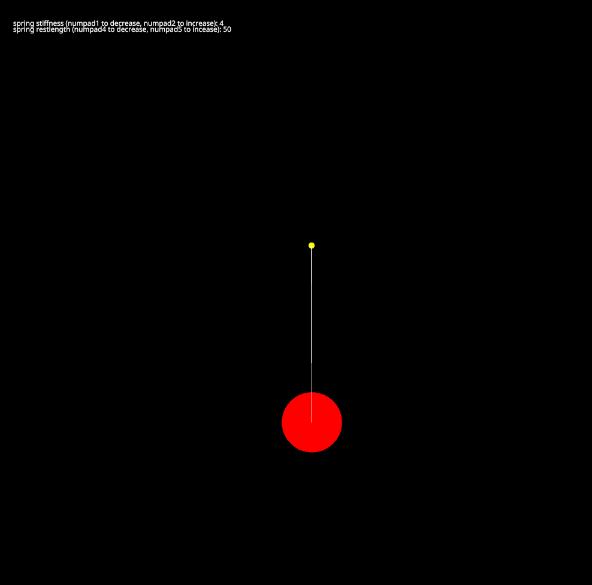

<h1>Simple Harmonic Motion/h1>

Implementation done using Rust and Nannou crate.

If you would like to try playing with this, you will need to:
* [Install Rust](https://www.rust-lang.org/learn/get-started)
* Pull the repository
* In the terminal `cargo run`

